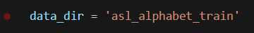
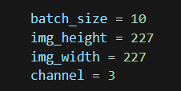
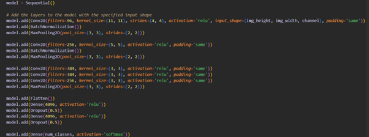
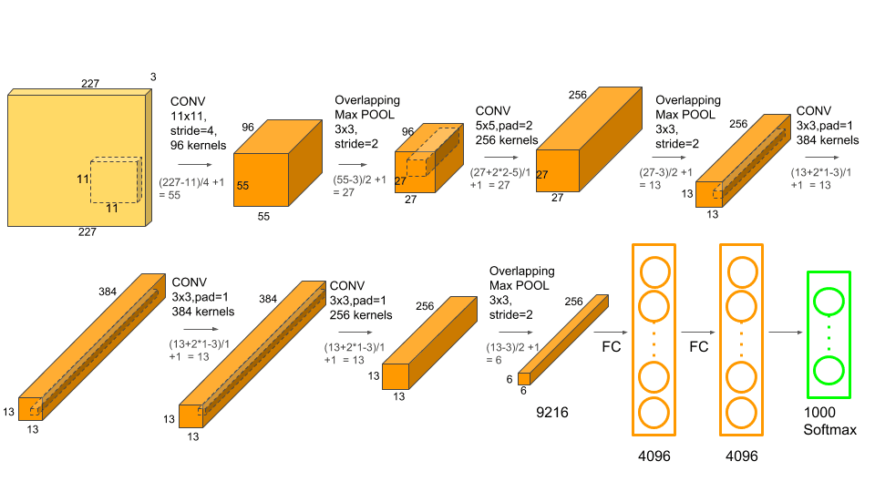

# project การแปลงภาษามือเป็นข้อความโดยใช้ cnn

# set up code
# train model (recommend nvidia gpu)
- Clone a GitHub repository \
git clone https://github.com/TMDDraGon/sign-Language-cnn.git
- setup_environment(Miniconda) \
source sign-Language-cnn/setup_environment.sh
- Open the cloned repository in VSCode \
code Documents/sign-Language-cnn/
- Deactivate the conda environment \
conda deactivate
- Remove the conda environment named tf_env \
conda remove -y -n tf_env --all
# camera(in windoe only)
python will be install from pyhon web

pip install opencv-python matplotlib numpy mediapipe keras Pillow \
pip install tensorflow

# edit 
if you want to change dataset, you can change asl_alphabet_train ( you can should from https://www.kaggle.com/search?q=sign+Language+in%3Adatasets )\
chang to dataset name \

set hyperparameter \
batch is example input \
height and width is size image \
channel is color image (3 is rgb)\

adjust\
chang model structure \

`ref`\
    - https://www.mdpi.com/1424-8220/23/18/7970 \
    - https://cs231n.github.io/convolutional-networks/\
    - https://www.mdpi.com/1424-8220/23/16/7156 \
    - https://cs231n.github.io/convolutional-networks/ \
    - https://medium.com/@605162020010/19-07-2562-%E0%B8%AB%E0%B8%A5%E0%B8%B1%E0%B8%87%E0%B8%88%E0%B8%B2%E0%B8%81%E0%B8%97%E0%B8%B5%E0%B9%88%E0%B8%9C%E0%B8%A1%E0%B8%AB%E0%B8%B2%E0%B8%A2%E0%B9%84%E0%B8%9B%E0%B8%99%E0%B8%B2%E0%B8%99%E0%B8%95%E0%B8%B4%E0%B8%94%E0%B8%AD%E0%B8%A2%E0%B8%B9%E0%B9%88%E0%B8%AB%E0%B8%A5%E0%B8%B2%E0%B8%A2%E0%B9%80%E0%B8%A3%E0%B8%B7%E0%B9%88%E0%B8%AD%E0%B8%87%E0%B8%97%E0%B8%B1%E0%B9%89%E0%B8%87%E0%B9%80%E0%B8%A3%E0%B8%B7%E0%B9%88%E0%B8%AD%E0%B8%87%E0%B9%80%E0%B8%A3%E0%B8%B5%E0%B8%A2%E0%B8%99-%E0%B8%9B-%E0%B9%82%E0%B8%97-498452e3fe84 \
    - https://blog.pjjop.org/transfer-learning-with-keras-for-computer-vision-applications/