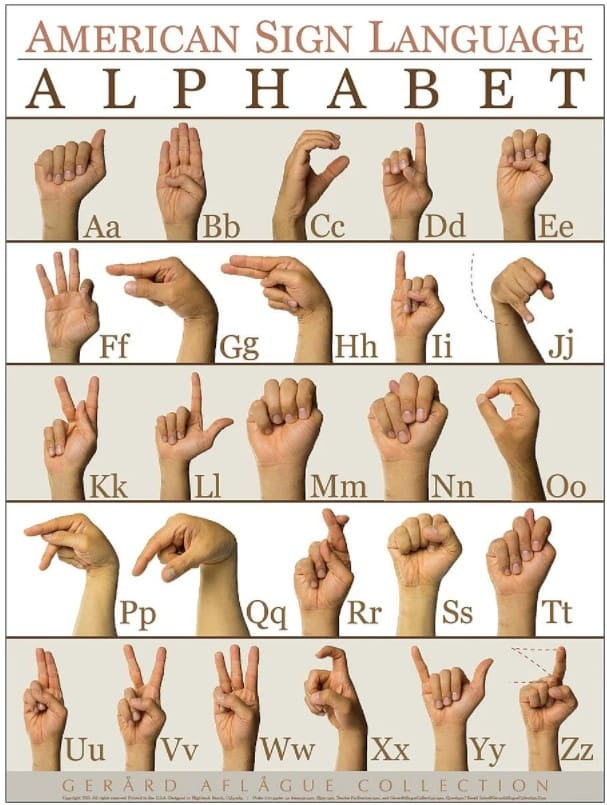
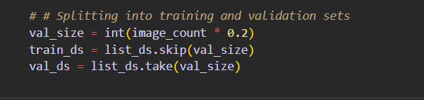

# project การแปลงภาษามือเป็นข้อความโดยใช้ cnn

## Abstract

Sign language is one of the oldest and most natural form of language for communication, but since most people do not know sign language and interpreters are very difficult to come by we have come up with a real time method using neural networks for fingerspelling based american sign language.
 
In this method, the hand is first passed through a filter and after the filter is applied the hand is passed through a classifier which predicts the class of the hand gestures. This method provides high accuracy for the 26 letters of the alphabet.

## Project Description

### Convolutional Neural Network(CNN)
Unlike regular Neural Networks, in the layers of CNN, the neurons are arranged in 3 dimensions: width, height, depth.       

The neurons in a layer will only be connected to a small region of the layer (window size) before it, instead of all of the neurons in a fully-connected manner.       

Moreover, the final output layer would have dimensions(number of classes), because by the end of the CNN architecture we will reduce the full image into a single vector of class scores.

#### 1. Convolutional Layer:  
In convolution layer I  have taken a small window size [typically of length 5*5] that extends to the depth of the input matrix. 

The layer consists of learnable filters of window size. During every iteration I slid the window by stride size [typically 1], and compute the dot product of filter entries and input values at a given position. 

As I continue this process well create a 2-Dimensional activation matrix that gives the response of that matrix at every spatial position. 

That is, the network will learn filters that activate when they see some type of visual feature such as an edge of some orientation or a blotch of some colour. 

#### 2. Pooling Layer: 
We use pooling layer to decrease the size of activation matrix and ultimately reduce the learnable parameters. 

There are two types of pooling:

##### a. Max Pooling: 
In max pooling we take a window size [for example window of size 2*2], and only taken the maximum of 4 values. 

Well lid this window and continue this process, so well finally get an activation matrix half of its original Size.

##### b. Average Pooling: 
In average pooling we take average of all Values in a window.

#### 3. Fully Connected Layer:
In convolution layer neurons are connected only to a local region, while in a fully connected region, well connect the all the inputs to neurons.

  

#### 4. Final Output Layer: 
After getting values from fully connected layer, well connect them to final layer of neurons [having count equal to total number of classes], that will predict the probability of each image to be in different classes.

## Training:
Image preprocessing routine before the images are fed into a model, which consists of several steps aimed at optimizing the images for better model performance. Initially, the process begins with loading the image using  function, followed by decoding the image into a JPEG format with a specified number of color channels using . Subsequently, the image is resized to the desired dimensions (, ) using , ensuring that all images fed into the model have uniform dimensions.tf.io.read_file(file_path)tf.image.decode_jpegimg_heightimg_widthtf.image.resize

To enhance the diversity of the training data and possibly improve the model's generalization ability, the routine incorporates data augmentation techniques such as random left-right flipping of the images (), random adjustments to the image brightness with a maximum delta of 0.9 (), and altering the image contrast randomly within specified lower and upper bounds (0.9 and 1.1, respectively) using . These augmentation steps introduce variability in the dataset, mimicking a broader range of scenarios that the model might encounter in real-world applications.tf.image.random_flip_left_righttf.image.random_brightnesstf.image.random_contrast

Furthermore, the pixel values of the images are rescaled by dividing by 255.0, converting them to a range between 0 and 1, which is a common practice for normalizing input data to neural networks, as it helps in speeding up the convergence during the training phase.

After preprocessing, these images are then mapped onto the training () and validation datasets () using the  method, which applies the  function to each item. This approach is complemented by utilizing  for parallel processing, enhancing the efficiency of data loading and preprocessing. The datasets are also batched () and prefetched, which further optimizes the training process by reducing the time the model spends waiting for data, thereby improving the overall computational efficiency and potentially the training speed of the model.train_dsval_ds.mappreprocess_imagetf.data.experimental.AUTOTUNEbatch_size

## Results:

# set up code
- open terminal

# train model (recommend nvidia gpu)
- Clone a GitHub repository \
git clone https://github.com/TMDDraGon/sign-Language-cnn.git
- setup_environment(Miniconda) \
source sign-Language-cnn/setup_environment.sh
- Open the cloned repository in VSCode \
code Documents/sign-Language-cnn/
- edit code \
look at headline edit
- Deactivate the conda environment (after train new model) \
conda deactivate
- Remove the conda environment named tf_env \
conda remove -y -n tf_env --all
# camera(not use wsl)
python will be install from pyhon web

- Install Python packages \
pip install opencv-python matplotlib numpy mediapipe keras Pillow tensorflow

- Run Python script \
python camera.py

# edit 
if you want to change dataset, you can change asl_alphabet_train ( you can should from https://www.kaggle.com/search?q=sign+Language+in%3Adatasets )\
chang to dataset name \

set hyperparameter \
batch is example input \
height and width is size image \
channel is color image (3 is rgb)\

add data audmentation \
to add new detail in image

set split data \
in my code train 80 test 20 (0.2) \

adjust\
chang model structure \
you can add new layer \

## ref
\
    - https://www.mdpi.com/1424-8220/23/18/7970 \
    - https://cs231n.github.io/convolutional-networks/\
    - https://www.mdpi.com/1424-8220/23/16/7156 \
    - https://medium.com/@605162020010/19-07-2562-%E0%B8%AB%E0%B8%A5%E0%B8%B1%E0%B8%87%E0%B8%88%E0%B8%B2%E0%B8%81%E0%B8%97%E0%B8%B5%E0%B9%88%E0%B8%9C%E0%B8%A1%E0%B8%AB%E0%B8%B2%E0%B8%A2%E0%B9%84%E0%B8%9B%E0%B8%99%E0%B8%B2%E0%B8%99%E0%B8%95%E0%B8%B4%E0%B8%94%E0%B8%AD%E0%B8%A2%E0%B8%B9%E0%B9%88%E0%B8%AB%E0%B8%A5%E0%B8%B2%E0%B8%A2%E0%B9%80%E0%B8%A3%E0%B8%B7%E0%B9%88%E0%B8%AD%E0%B8%87%E0%B8%97%E0%B8%B1%E0%B9%89%E0%B8%87%E0%B9%80%E0%B8%A3%E0%B8%B7%E0%B9%88%E0%B8%AD%E0%B8%87%E0%B9%80%E0%B8%A3%E0%B8%B5%E0%B8%A2%E0%B8%99-%E0%B8%9B-%E0%B9%82%E0%B8%97-498452e3fe84 \
    - https://blog.pjjop.org/transfer-learning-with-keras-for-computer-vision-applications/ \
    - https://github.com/emnikhil/Sign-Language-To-Text-Conversion